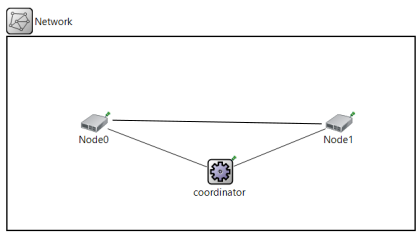
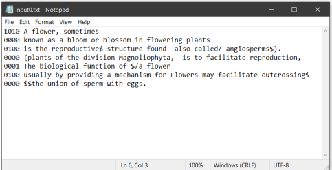
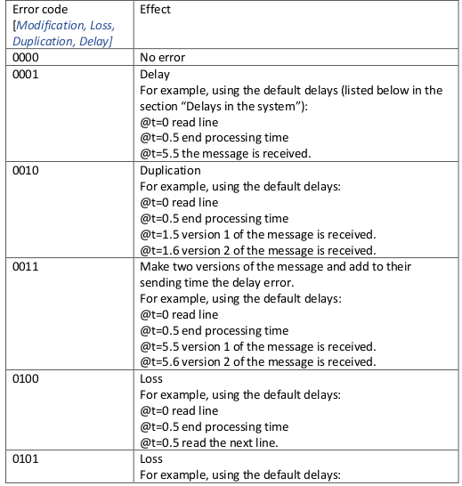
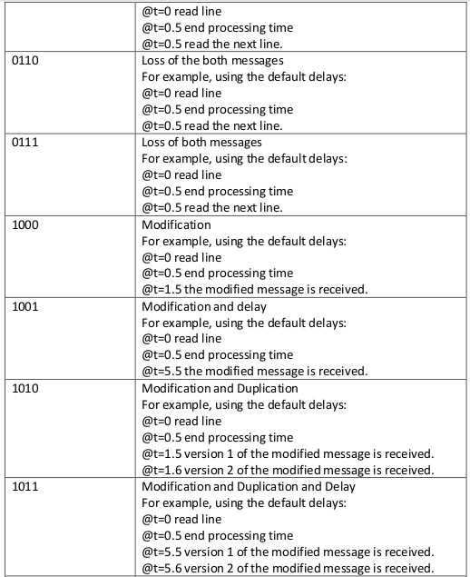
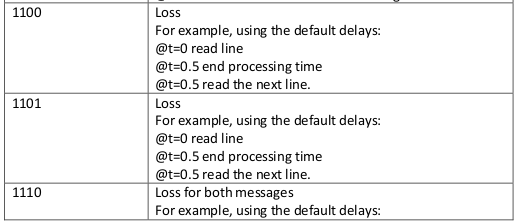
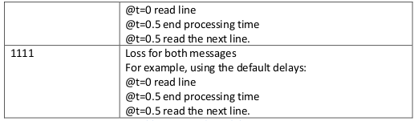

# Data Link Layer Protocols Simulation

In this project, we develop, simulate and test data link layer protocols between two nodes that are connected with a noisy channel, where the transmission is not error-free, packets may get corrupted, duplicated, delayed, or lost, and the buffers are of limited sizes.

**The design of the system’s network:**

The system network topology is shown in the figure. It consists of one pair of nodes [Node0, Node1], and one coordinator that is connected to the pair.

In this project, the pair of nodes would communicate and exchange messages using the **Go Back N** algorithm with noisy channel and sender window of size WS, receiver window of size WR=1, using **Byte Stuffing** as a framing algorithm, and **checksum** as an error detection algorithm.

## System inputs:

<ol>
     <li>
          Each node has a list of messages to send, and each node reads its list of messages from a different input text file; namely ‘input0.txt’ for Node0 and ‘input1.txt’ for Node1.
     </li>
     <li>
          Each message starts in a new line, and there is a 4-bits binary prefix before each message. These 4-bits represent the possibility of [Modification, Loss, Duplication, Delay] that would affect this message. For example, “1010 Data Link” means that the message “Data Link” will have a modification to one of its bits while sending, and will be sent twice. Figure2 includes an example of the input file.

 
     </li>
     <li>
     Table 1 contains the details of the errors and their priorities:
     <ul>
          <li>
               
          </li>

          <li>
               
          </li>

          <li>
               
          </li>

          <li>
               
          </li>
     </ul>
     </li>
     <li>
          The coordinator starts working in the initialization stage, its main job is to assign choose which node of the pair should start, and when to start in seconds. The coordinator gets this information from an input file “coordinator.txt”.

It will contain one line contains [“Node_id” “starting_time”] for the starting node, and Node_id=[0,1].

After the coordinator sends the initialization messages, the starting node should start reading its messages from its file on the **specified starting time**, and the receiver will respond back as will be described later. The messages between the peer don’t pass through the coordinator.

Although at any session, only one file containing the messages is read and the other will not be used, we keep both files in case the coordinator would choose any one of the nodes to start freely in later sessions or runs of the program.
     </li>
     <li>
     Parameters that are set in the .ini file:
<ul>
     <li> The sender window of size WS, by default=3</li>
     <li> The channel’s transmission delay TD for any frame, by default=1.0</li>
     <li> The timeout interval TO in seconds for the Go Back N protocol, by default=10</li>
     <li> The sender’s and receivers’ processing time PT for each frame, by default=0.5</li>
     <li> The channel’s error delay ED for any frame, by default=4.0</li>
     <li> The channel’s duplication delay DD before sending the second version, by default=0.1</li>
     <li> ACK/NACK frame loss probability LP, by default =0%.</li>
</ul>
     </li>
</ol>

## Delays in the system:

We have several delays in the system as follows:

1. **Processing delay**, and this happens at both pairs for any frame to be sent, and it takes a delay = **PT** as set from the .ini file.

2. **Transmission delay**, and this happens at both ways of the channel while sending any frame, and it takes a delay = **TD** as set from the .ini file.

3. **Error delay**, and this happens at if an error delay to be introduced to any frame, and it takes a delay = **ED**, as a result, the frame will have a **total sending delay = TD + ED**. This is also set from the .ini file. Note that the delayed message can cause out of order delivery of messages. I.e., delayed messages don’t lock the sender and prevent him from send the next frame on time. The delay happens in the transmission channel and should not stop the sender from continuing.

4. **Duplication Delay DD** for any Duplicated message, the first version is sent as usual using the PT, and then, the second version is sent after the DD after the first version not just PT.

## System outputs:

The system print one log file named [output.txt], containing the details for each message transmission from both nodes using the following format:

## Messages

Every message contains the following fields:

- Header: the data sequence number.

- Payload: the message contents after byte stuffing (in characters).

- Trailer: the parity byte.

- Frame type: Data=2/ ACK=1 /NACK=0. 

- ACK/NACK number.

## Framing

Is done using the byte stuffing algorithm with starting and ending bytes.

The flag byte is ‘$’ and the escape character is ‘/’.

The framing is applied to the message payload only.

There is no specific maximum transmission size for the frame, each message is represented with one line in the input file.

The receiver should get the original payload upon receiving the message. [de-frame] and print it.

## Error detection

This is done using the checksum algorithm.

The checksum checks for the payload after applying the byte stuffing.

The checksum is added to the message trailer field.

The receiver uses the checksum to detect if there is/isn’t any single bit error during the transmission and so decides to send ACK/NACK.

The ACK/NACK number are set as the sequence number of the next correct expected frame.

NACKs are sent for errored but in order messages only.

## The Go Back N protocol

Implementing the Go Back N protocol taking into consideration the time-out and the window size with the noisy channel. Where the max seq number = the windows size:
<ol>
  <li> The coordinator reads the initialization from the ‘coordinator.txt’ file and sends the information to the pair.</li>
  <li> The starting node reads the input file and starts sending at the specific given time, and takes into account the four types of errors. It will send the frames within its sending window size WS with PT between frames as its processing speed.</li>
  <li> The sender sends data and receiver responds with control frame; “ACK” if no error and with “NACK” if there is an error.</li>
  <li> Each message data/control is given an id according to the Go Back N protocol and starts from zero and up to the window size and not to infinity.</li>
  <li> The receiver always responds for any received packet with control message (and no payload) with a loss probability (LP) as set in the ini file.</li>
  <li> The session ends when the sender node finishes sending all the messages in its input file.</li>
  <li> There is a timer in the sender side, when the timer goes off, all the messages in the sender’s window will be transmitted again as usual with the normal calculations for errors and delays except for the first frame that is the cause for the timeout, it will be sent error free.</li>
  <li> After the timeout event, the sender will have to send the messages again, taking into account the processing time before each frame.</li>
  <li> We will enhance the G-Back-N algorithm a little:
  <ol>
    <li> upon receiving a NACK , the sender will stop what he is processing</li>
    <li> and start by sending the errored message again “error free this time”</li>
    <li> the message is sent after the processing time +0.001 (to break any possible ties).</li>
    <li> and then the following messages proceed as normal.</li>
  </ol>
  </li>
</ol>
